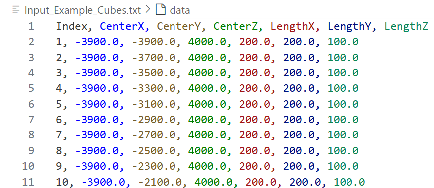
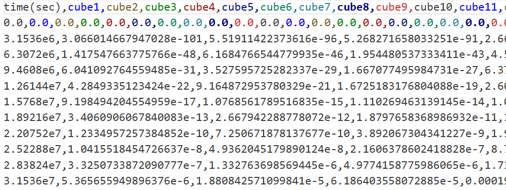
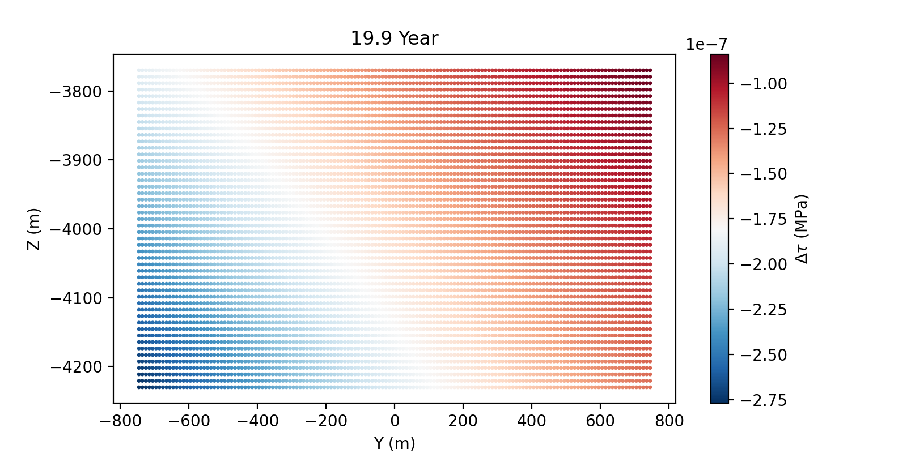

# Flow2QuakeDFN

## Introduction
This project focuses on simulating earthquake rupture in response to the change in pore-pressure of reservoir. The physics underlying this process involves the coupling between pore pressure, poro-elastic stress, and rate-and-state fault dynamics. We'll use the case `Example` to demonstrate the whole workflow, where fluid is injected to a flat reservoir and induce earthquake rupture on a flat dipping fault offsetting to the injection point. The below movie showcase the above physical process and will be produced at the end of the workflow.

<video controls src="injection_rupture.mp4" title="Title"></video>

## Workflow
### Reservoir Mesh Generation
Create a computational mesh for the reservoir. In this example, the reservoir consists of 40*40 **cuboids** meshes.

```
python ReservoirMeshExamples/Example_Generate_Cubes.py
```


You can check the positinos of all the reservoir cubes via the *Input_Example_Cubes.txt* file:



### Pore Pressure Calculation
Assign the time and changes in pore pressure within each reservoir cuboid. 

```
julia PorePressureExamples/Example_Generate_Cubes.jl
``` 

You can check the pore pressure changes at each time in each reservoir cube in the *Input_Example_PorePressureChange.csv* file.



### Poroelastic Stress Calculation 
Compute the resulting poroelastic stress changes. 

```
julia ExternalStressCalculationExamples/Example_PoroStress.jl
```

*Plot_InitialStress.ipynb* file provides the necessary codes to visualize the computed external shear and effective normal stress.



### Fault Geometry
Generate bulk fault geometry and fine meshes.

```
julia InputGeometryExamples/Example_BuildGeometry_Single_Normal.jl
julia RUN_BUILD_INPUT.jl
```

### Intitial Stress
We have to set the initial shear&normal stresses on each fault patch. The systematic approach is to do it in the *QuickParameterAdjust.jl* file, which will ne implemented automatically when running the QuakeDFN simulation.

### QuakeDFN Simulation
```
julia RUN_QUAKEDFN.jl
```

### Post-processing (Paraview)
```
julia Plot_ResultWrite2VTK.jl
```